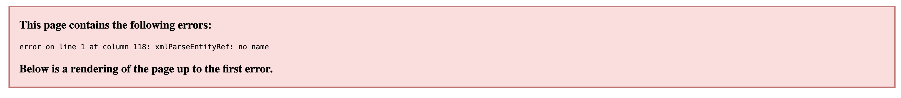

# Frontend Mentor - Blog preview card solution

This is a solution to the [Blog preview card challenge on Frontend Mentor](https://www.frontendmentor.io/challenges/blog-preview-card-ckPaj01IcS). Frontend Mentor challenges help you improve your coding skills by building realistic projects.

## Table of contents

- [Overview](#overview)
  - [The challenge](#the-challenge)
  - [Links](#links)
- [My process](#my-process)
  - [What I learned](#what-i-learned)
  - [Useful resources](#useful-resources)

### The challenge

Users should be able to:

- See hover and focus states for all interactive elements on the page

### Links

- Live Site URL: [Add live site URL here](https://jammim.github.io/blog-preview-card-ff/)

### What I learned

To use 'prefers-reduced-motion' for acessibilty

```css
@media (prefers-reduced-motion: reduce) {
  .blogcard,
  .blogcard__heading {
    animation: none;
  }
}
```

To be more careful when working with svg files

```xml
<svg aria-label="HTML &amp; CSS foundations thumbnail">
```

&amp; was causing the following error within the svg file


so I swapped &amp; with 'and'

### Useful resources

- [Josh w comeau's A Modern CSS Reset](https://www.joshwcomeau.com/css/custom-css-reset/) - This helped me for XYZ reason. I really liked this pattern and will use it going forward.
- [Serving responsive images](https://web.dev/articles/serve-responsive-images) - This is an amazing article which helped me responsive images.
- [imageresizer.com](https://imageresizer.com/resize-webp) - Handy for resizing images responsive images.
